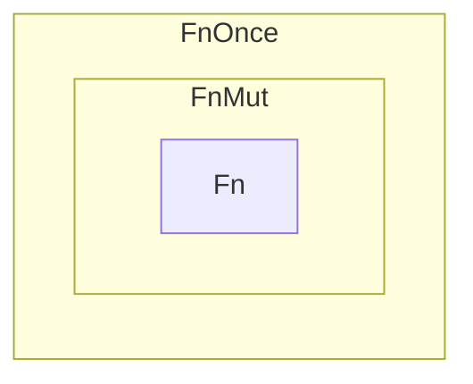
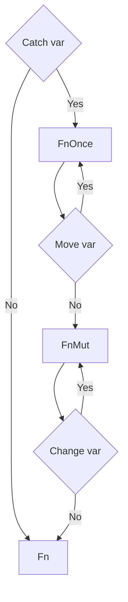

# &#38381;&#21253;

## 概念
* 闭包是可以捕获外部变量的代码块。
* 根据对捕获变量的使用方式不同，**分为Fn**、**FnMut**、**Fn**三种类型。
* 三种类型约束：`Fn:FnMut:FnOnce`。

```mermaid
flowchart LR
    subgraph FnOnce 
        subgraph FnMut 
            Fn
        end
    end
```

## 判断方式

```mermaid
graph TD
    A{Catch var}
    A-->|No|B[Fn]
    A-->|Yes|C[FnOnce]
    C-->D{Move var}
    D-->|Yes|C
    D-->|No|E[FnMut]-->F{Change var}
    F-->|Yes|E
    F-->|No|B
```